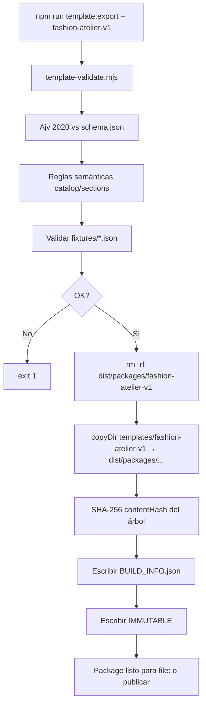

# PACKAGE PORTABILITY & RUNTIME CONTRACT

**Template:** `fashion-atelier-v1`  
**Package npm:** `@web-generator/fashion-atelier-v1`  
**Fecha:** 2026-07-28  
**Estado:** Export verificado + clean-host build OK  
**Referencias:** [`templates/fashion-atelier-v1/PROOF.md`](../templates/fashion-atelier-v1/PROOF.md), [`scripts/template-export.mjs`](../scripts/template-export.mjs)

---

## 0. Resumen ejecutivo

Este documento es la especificación formal de:

1. Qué contiene el export inmutable en `dist/packages/fashion-atelier-v1/`
2. Cómo un host limpio importa y monta el template
3. Prueba de que el host no depende de `src/` ni `templates/` del monorepo
4. API pública de inyección de payload
5. Significado operativo de **inmutable**
6. Versionado, dependencias y proceso exacto de exportación

**Regla de oro:** la IA / Builder solo genera o edita un **Content Payload**. El código del template permanece fijo dentro del package.

---

## Catalog bindings (`manifest.constraints`)

El host SaaS vacía el catálogo demo del payload y rehidrata el inventario del tenant. Para no hardcodear `templateId`, cada package ecommerce declara **bindings canónicos** en `manifest.json`:

| Clave | Obligatorio | Significado |
|-------|-------------|-------------|
| `catalogRefs` | Sí (si hay productos en catalog) | Todos los `sections.*.productIds` / `sections.*.collectionIds` |
| `catalogBindings` | Sí (uno por cada catalogRef) | Metadata UI: `kind`, `sectionId`, `label` i18n, `maxItems` |
| `commerceFeaturedProductsPath` | Recomendado | Un path donde el host escribe featured products |
| `commerceFeaturedCollectionsPath` | Si hay grid de colecciones | Un path para featured collections; omitir si no aplica |

Los **nombres de sección** (`featured`, `signature`, `programs`, `occasions`…) son libres por diseño. Las **claves** anteriores no.

Ejemplo Celestine:

```json
"constraints": {
  "catalogRefs": [
    "sections.signature.productIds",
    "sections.accessories.productIds",
    "sections.occasions.collectionIds"
  ],
  "catalogBindings": [
    {
      "path": "sections.signature.productIds",
      "kind": "product",
      "sectionId": "signature",
      "label": { "es": "Looks firma", "en": "Signature looks" },
      "maxItems": 8
    },
    {
      "path": "sections.accessories.productIds",
      "kind": "product",
      "sectionId": "accessories",
      "label": { "es": "Accesorios", "en": "Accessories" },
      "maxItems": 12
    },
    {
      "path": "sections.occasions.collectionIds",
      "kind": "collection",
      "sectionId": "occasions",
      "label": { "es": "Ocasiones", "en": "Occasions" },
      "maxItems": 4
    }
  ],
  "commerceFeaturedProductsPath": "sections.signature.productIds",
  "commerceFeaturedCollectionsPath": "sections.occasions.collectionIds"
}
```

Aliases legacy (`featuredProductPath`, `collectionIdsPath`, `occasionIdsPath`, …) se mantienen 1 release. `npm run template:validate` exige IDs válidos, paths presentes, `catalogBindings` completo, sync builder↔routes, `listSchema` en slots `list`, y coherencia con `schema.json` `$defs.Sections`.

### Editor SaaS (builder.manifest)

- `pages` + `contentSlotIds` + `slotDefinitions` + `themeDefaults` + `themeEditable`
- `navigation.primaryFromPayload` → `defaults.navigation.primary`
- `brand.*` con `editorSurface: "none"`; sin slots `nav.*`
- React: `data-wb-slot="{slotId}"` en copy estático; `CommerceAwareCatalog` no pisa filtros si el payload no tiene taxonomy demo
- Shop listing: chips de categoría en **una línea** con scroll horizontal sin barra (`category-scroll` + `overflow-x-auto`; chips `shrink-0`) en `ProductListingView` y `ShopCatalog`
- Home hero: `<section>` en `Hero.tsx` con `h-[100svh] min-h-[640px]` (todos los breakpoints; no `md:h-[92svh]` ni otros `min-h`)

---

## 1. Qué contiene exactamente el export

### 1.1 Árbol completo de `dist/packages/fashion-atelier-v1/`

Snapshot del export (generado por `npm run template:export -- fashion-atelier-v1`):

```
dist/packages/fashion-atelier-v1/
├── BUILD_INFO.json
├── IMMUTABLE
├── PROOF.md
├── README.md
├── defaults.json
├── fixtures/
│   └── alt-brand.json
├── manifest.json
├── package.json
├── schema.json
└── src/
    ├── index.ts                 ← API pública
    ├── meta.ts
    ├── renderer.tsx             ← AtelierApp
    ├── components/
    │   ├── AddToCartForm.tsx
    │   ├── CartDrawer.tsx
    │   ├── CollectionStrip.tsx
    │   ├── EditorialBanner.tsx
    │   ├── FeaturedProducts.tsx
    │   ├── Footer.tsx
    │   ├── Header.tsx
    │   ├── Hero.tsx
    │   ├── Newsletter.tsx
    │   ├── ProductCard.tsx
    │   ├── Reveal.tsx
    │   ├── ShopCatalog.tsx
    │   └── pages/
    │       ├── AboutView.tsx
    │       ├── HomeView.tsx
    │       ├── ProductView.tsx
    │       └── ShopView.tsx
    ├── content/
    │   ├── load.ts              ← loadPayload / loadManifest
    │   ├── resolve.ts           ← media, precios, basePath
    │   ├── types.ts             ← ContentPayload
    │   └── validate.ts          ← schema + semántica
    ├── lib/
    │   ├── cart-context.tsx
    │   └── site-content.tsx     ← SiteContentProvider
    └── styles/
        └── atelier.css
```

### 1.2 Rol de cada artefacto de cabecera

| Archivo | Rol |
|---------|-----|
| `manifest.json` | Identidad del template, rutas, capabilities, media slots |
| `schema.json` | JSON Schema del Content Payload (contrato IA/Builder) |
| `defaults.json` | Payload golden — contenido visual aprobado |
| `fixtures/*.json` | Payloads alternos para pruebas (p. ej. `alt-brand`) |
| `package.json` | Nombre npm, `exports`, peerDependencies |
| `src/` | Runtime React/Next del template |
| `BUILD_INFO.json` | Metadatos del export: version, hash, timestamp |
| `IMMUTABLE` | Señal explícita: no editar a mano; regenerar |
| `PROOF.md` / `README.md` | Operación y aceptación |

### 1.3 `BUILD_INFO.json` (ejemplo real)

```json
{
  "templateId": "fashion-atelier-v1",
  "version": "1.0.0",
  "exportedAt": "2026-07-28T18:44:28.486Z",
  "contentHash": "6553611e2962b1c1c2931af86e0b47b29ceba3d6f9df3c4cd125613feac0e8fd",
  "immutable": true,
  "source": "templates/fashion-atelier-v1"
}
```

`contentHash` = SHA-256 del árbol exportado (paths relativos + bytes de cada archivo). Cualquier cambio regenera un hash distinto.

### 1.4 `package.json` del package — exports y peers

```json
{
  "name": "@web-generator/fashion-atelier-v1",
  "version": "1.0.0",
  "main": "./src/index.ts",
  "exports": {
    ".": "./src/index.ts",
    "./defaults.json": "./defaults.json",
    "./schema.json": "./schema.json",
    "./manifest.json": "./manifest.json",
    "./styles.css": "./src/styles/atelier.css"
  },
  "peerDependencies": {
    "next": ">=15",
    "react": ">=19",
    "react-dom": ">=19",
    "lucide-react": "*",
    "ajv": "*",
    "ajv-formats": "*"
  }
}
```

---

## 2. API pública del package

Punto de entrada: `@web-generator/fashion-atelier-v1` → `src/index.ts`.

### 2.1 Constantes

| Export | Tipo | Descripción |
|--------|------|-------------|
| `TEMPLATE_ID` | `"fashion-atelier-v1"` | ID canónico |
| `TEMPLATE_SLUG` | `"atelier"` | Slug de montaje en lab |
| `DEFAULT_BASE_PATH` | `"/t/atelier"` | Base path del laboratorio |

### 2.2 Tipos

| Export | Descripción |
|--------|-------------|
| `ContentPayload` | Contrato completo del sitio |
| `TemplatePage` | `"home" \| "shop" \| "product" \| "about"` |
| `ResolvedProduct` | Producto con URLs/categoría resueltas |
| `MediaRef` | `{ mediaId?, url?, alt }` |

### 2.3 Carga y validación

| Export | Firma | Descripción |
|--------|-------|-------------|
| `loadPayload(fixture?: string)` | `→ ContentPayload` | Sin arg / `"defaults"` → `defaults.json`. Con `"alt-brand"` → `fixtures/alt-brand.json`. Valida schema + semántica. |
| `loadManifest()` | `→ Record<string, unknown>` | Lee `manifest.json` |
| `getPackageRoot()` | `→ string` | Resuelve raíz del package instalado |
| `validatePayload(payload)` | `→ { ok: true } \| { ok: false, errors: string[] }` | Ajv 2020 + reglas semánticas |

### 2.4 Resolución / helpers

| Export | Uso |
|--------|-----|
| `withBasePath(basePath, href)` | Prefija rutas relativas del payload |
| `resolveMediaUrl(ref, media?)` | `mediaId`/`url` → URL absoluta |
| `resolveProducts(payload)` | Catálogo → `ResolvedProduct[]` |
| `getProductBySlug(payload, slug)` | PDP |
| `getFeaturedProducts(payload)` | Home destacados |
| `getHomeCollections(payload)` | Home colecciones |
| `formatPrice(amount, locale, currency)` | Precio |
| `themeStyle(payload)` | CSS variables desde `theme.colors` |

### 2.5 Renderer (inyección de payload)

```tsx
import { AtelierApp, loadPayload } from "@web-generator/fashion-atelier-v1";

<AtelierApp
  page="home" | "shop" | "product" | "about"
  payload={ContentPayload}   // ← inyección
  basePath={string}          // "" en clean-host; "/t/atelier" en lab
  slug?: string              // requerido en page="product"
/>
```

Comportamiento interno:

1. `SiteContentProvider` recibe `payload` + `basePath` y aplica `themeStyle`.
2. `CartProvider` envuelve el shell.
3. Renderiza `Header` + vista (`HomeView` / `ShopView` / `ProductView` / `AboutView`) + `Footer` + `CartDrawer` (si `features.cart !== false`).
4. Todos los textos/imágenes/productos salen del `payload`; no hay copy hardcodeado en el runtime.

### 2.6 Subpath exports

```ts
import defaults from "@web-generator/fashion-atelier-v1/defaults.json";
import schema from "@web-generator/fashion-atelier-v1/schema.json";
import manifest from "@web-generator/fashion-atelier-v1/manifest.json";
import "@web-generator/fashion-atelier-v1/styles.css";
```

---

## 3. Cómo importa el host limpio el template

### 3.1 Dependencia (línea exacta de integración)

En [`hosts/clean-host/package.json`](../hosts/clean-host/package.json):

```json
"@web-generator/fashion-atelier-v1": "file:../../dist/packages/fashion-atelier-v1"
```

Esto es la **única** referencia al monorepo: el artefacto ya exportado en `dist/`. No hay dependencia a `templates/` ni a `src/` del lab.

### 3.2 Código mínimo del clean-host

**Home** ([`hosts/clean-host/src/app/page.tsx`](../hosts/clean-host/src/app/page.tsx)):

```tsx
import { AtelierApp, loadPayload } from "@web-generator/fashion-atelier-v1";

const BASE_PATH = "";

export default function HomePage() {
  const payload = loadPayload();
  return <AtelierApp page="home" payload={payload} basePath={BASE_PATH} />;
}
```

**Layout** (fonts del host + metadata desde payload):

```tsx
import { loadPayload } from "@web-generator/fashion-atelier-v1";
const payload = loadPayload();
// metadata.title / description desde payload.seo
```

**Next config:**

```ts
transpilePackages: ["@web-generator/fashion-atelier-v1"]
```

**CSS del host:**

```css
@import "tailwindcss";
@source "../../node_modules/@web-generator/fashion-atelier-v1/src";
@import "@web-generator/fashion-atelier-v1/styles.css";
```

Rutas thin equivalentes: `/tienda`, `/tienda/[slug]`, `/nosotros` — mismo patrón `AtelierApp` + `loadPayload()`.

### 3.3 Inyección de payload — API exacta

| Escenario | Código |
|-----------|--------|
| Defaults del package | `const payload = loadPayload()` |
| Fixture del package | `const payload = loadPayload("alt-brand")` |
| Payload externo (Builder) | `const payload = validateAndUse(myJson)` luego `<AtelierApp payload={payload} … />` |

Flujo recomendado en plataforma:

```
Builder genera/edita JSON
  → validatePayload(json)  // o Ajv contra schema.json del package
  → AtelierApp({ page, payload, basePath })
```

El host **no** reimplementa secciones; solo elige `page` + pasa `payload`.

---

## 4. ¿El host está realmente limpio?

### 4.1 Criterio

Un host se considera **limpio** si:

1. Depende del package vía `file:…/dist/packages/…` o registro npm.
2. Los imports de aplicación usan solo `@web-generator/fashion-atelier-v1` (y peers públicos).
3. **No** importa `@/*` del lab, ni `templates/…`, ni rutas absolutas al workspace `src/`.

### 4.2 Verificación realizada (grep en `hosts/clean-host`)

| Origen | ¿Usado por clean-host? |
|--------|------------------------|
| `file:../../dist/packages/fashion-atelier-v1` | Sí — dependencia declarada |
| `from "@web-generator/fashion-atelier-v1"` | Sí — todas las páginas |
| `from "@/…"` (lab) | **No** |
| `templates/fashion-atelier-v1` (fuente) | **No** |
| `Web Generator/src/…` | **No** |

Los paths de `tsconfig` del clean-host apuntan a:

```
./node_modules/@web-generator/fashion-atelier-v1/src/...
```

que npm resuelve a `dist/packages/fashion-atelier-v1` (symlink `file:`). No a `templates/` fuente.

### 4.3 Conclusión de portabilidad

**Demostrada** para el criterio actual: el clean-host builda y renderiza usando únicamente el package en `dist/` + dependencias públicas (`next`, `react`, `lucide-react`, `ajv`, `tailwind`).

> Nota: `file:../../dist/...` es relativo al monorepo por conveniencia local. En producción SaaS, el mismo package se publicaría/consumiría como tarball o registro privado; la API de import no cambia.

---

## 5. Proceso exacto de exportación

### 5.1 Comandos

```bash
# Desde la raíz del monorepo
npm run template:validate -- fashion-atelier-v1
npm run template:export  -- fashion-atelier-v1
```

Implementación: [`scripts/template-validate.mjs`](../scripts/template-validate.mjs), [`scripts/template-export.mjs`](../scripts/template-export.mjs).

### 5.2 Pasos del export (orden)



### 5.3 Validación semántica mínima

Además del JSON Schema:

- `categoryId` / `collectionId` de cada producto existen
- `sections.collections.collectionIds` existen y **length === 3** (contrato de este template)
- `sections.featured.productIds` existen en catálogo
- Imagen de producto con `url` o `mediaId`

### 5.4 Después del export

```bash
npm install --prefix hosts/clean-host   # re-linkea file: a dist
npm run build --prefix hosts/clean-host
```

---

## 6. Reglas de versionado e inmutabilidad

### 6.1 Qué significa “inmutable”

**Definición operativa:**

1. El directorio `dist/packages/<templateId>/` es un **artefacto de build**, no una working copy.
2. Está prohibido editar a mano archivos dentro de `dist/packages/...`.
3. Cualquier cambio se hace en `templates/<templateId>/` (fuente) y se **regenera** el export.
4. El archivo `IMMUTABLE` y el flag `"immutable": true` en `BUILD_INFO.json` documentan esta política.
5. El `contentHash` permite detectar drift: si alguien modifica `dist/` sin reexportar, el hash ya no coincide con un export limpio.

**No significa:**

- Que el template no pueda evolucionar (sí puede: nueva versión).
- Que el Content Payload sea inmutable (el payload es por sitio; cambia por marca/productos).

Separación:

| Capa | ¿Inmutable? | Qué cambia |
|------|-------------|------------|
| Código + schema + defaults del package versionado | Sí por versión exportada | Solo con bump + re-export |
| Content Payload de un sitio cliente | No | Builder / usuario / IA |

### 6.2 Versionado SemVer del template

Formato: `MAJOR.MINOR.PATCH` en `package.json` + `manifest.version` + `templateVersion` del payload.

| Cambio | Bump | Ejemplo |
|--------|------|---------|
| Fix visual/bug sin romper schema ni slots | PATCH | `1.0.0` → `1.0.1` |
| Nuevos campos **opcionales** en schema / slots aditivos | MINOR | `1.0.1` → `1.1.0` |
| Cambiar layout, quitar sección, romper schema, renombrar slots | MAJOR | `1.1.0` → `2.0.0` |

Reglas:

- Un payload con `templateVersion` debe ser compatible con el `package.version` del renderer (misma major recomendada).
- `templateId` estable (`fashion-atelier-v1`); un breaking visual grande puede ser `fashion-atelier-v2` **nuevo template**, no un parche silencioso.
- Sites publicados deben **pinnear** `templateId` + `version` (o `contentHash`) del package usado en deploy.

### 6.3 Política de defaults

- `defaults.json` = golden visual del template.
- Cambiar defaults en PATCH solo si corrige contenido demo sin alterar contrato.
- Fixtures (`alt-brand`) demuestran que el diseño no depende de un único copy.

---

## 7. Dependencias runtime y peer dependencies

### 7.1 Peer dependencies del template (las provee el host)

| Peer | Rango | Motivo |
|------|-------|--------|
| `next` | `>=15` | App Router, `next/image`, `next/link`, `next/font` en host |
| `react` / `react-dom` | `>=19` | Runtime UI |
| `lucide-react` | `*` | Iconos del shell |
| `ajv` / `ajv-formats` | `*` | Validación de payload |

### 7.2 Responsabilidad del host

- Instalar peers.
- Configurar `transpilePackages` si el package se consume como fuente TS.
- Whitelist de dominios de imagen (`images.remotePatterns`) según CDN del SaaS.
- Cargar fuentes si el template asume CSS variables `--font-cormorant` / `--font-montserrat` (como en Atelier). **Otro template puede exigir otras fuentes** — declarado en su `manifest`.

### 7.3 Lo que NO va dentro del package como dependencia bundada

Next/React se dejan como peers para evitar duplicar instancias en el host.

---

## 8. PROOF.md — procedimiento de aceptación

Fuente canónica operativa: [`templates/fashion-atelier-v1/PROOF.md`](../templates/fashion-atelier-v1/PROOF.md).

Resumen:

| # | Prueba | Cómo |
|---|--------|------|
| 1 | Sin hardcode de contenido en JSX | Runtime lee payload |
| 2 | Render solo con defaults | `/t/atelier` → `loadPayload()` |
| 3 | Otro payload | `/t/atelier?payload=alt-brand` |
| 4 | Diseño intacto | Mismas secciones; cambia copy/media |
| 5 | Export | `dist/packages/fashion-atelier-v1` + hash |
| 6 | Host limpio | `file:../../dist/packages/...` |
| 7 | Mismo template | `AtelierApp` desde package |

---

## 9. Matriz de montaje: Lab vs Clean-host

| Aspecto | Lab (`/t/atelier`) | Clean-host (`:3010`) |
|---------|--------------------|----------------------|
| Origen del código | Path alias / fuente `templates/` (dev) | `dist/packages/...` vía npm `file:` |
| `basePath` | `/t/atelier` | `""` |
| Payload default | `loadPayload()` | `loadPayload()` |
| Payload alt | `?payload=alt-brand` | `loadPayload("alt-brand")` (si se cablea) |
| Objetivo | Diseño + iteración | Prueba de portabilidad |

---

## 10. Extensión a N templates (sin unificar estructura)

Cada template es un package independiente:

- Su propio `schema.json` (secciones distintas permitidas)
- Su propio `AtelierApp`-equivalente (`XxxApp` / renderer)
- Su propio `manifest.sections[]`

**No** existe un mega-schema único de secciones. El Builder elige `templateId` y valida contra **ese** schema.

Lineamiento de producto (Cursor rule): ver [`.cursor/rules/template-packages.mdc`](../.cursor/rules/template-packages.mdc).

---

## 11. Checklist de release de un package

- [ ] `npm run template:validate -- <id>` OK  
- [ ] `npm run template:export -- <id>` genera `BUILD_INFO.json` + `IMMUTABLE`  
- [ ] Clean-host (o consumidor) depende solo de `dist/` / registry  
- [ ] Imports del host = package name, sin `templates/` ni lab `src/`  
- [ ] `AtelierApp` (o renderer) + `loadPayload` documentados  
- [ ] SemVer actualizado si el contrato cambió  
- [ ] PROOF actualizado si cambió el flujo de aceptación  

---

*Fin del documento — Package Portability & Runtime Contract*
